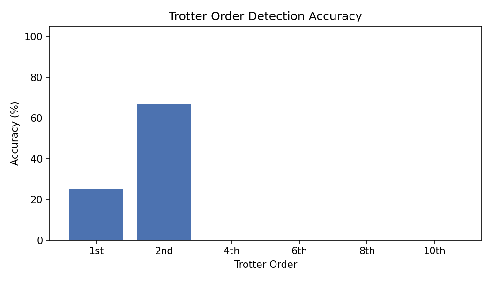
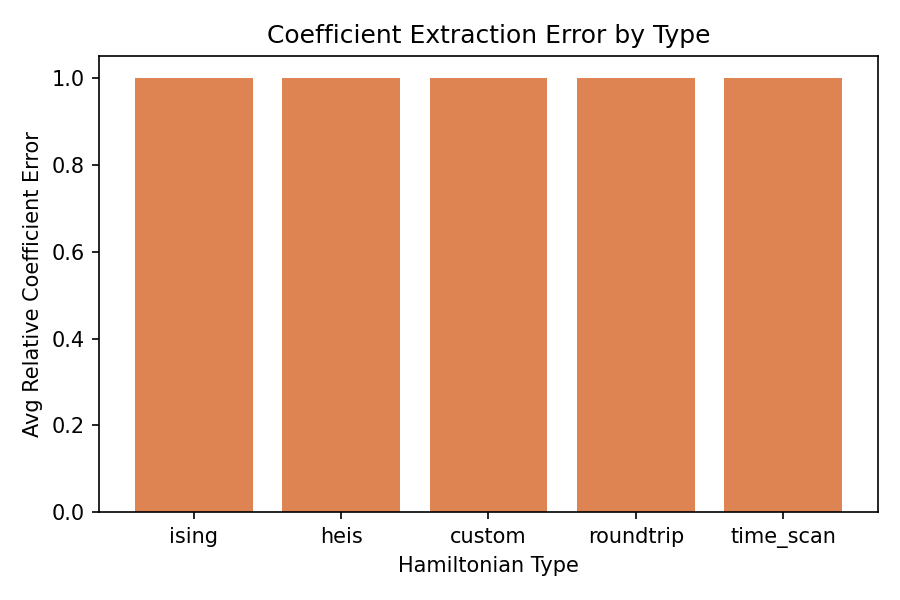
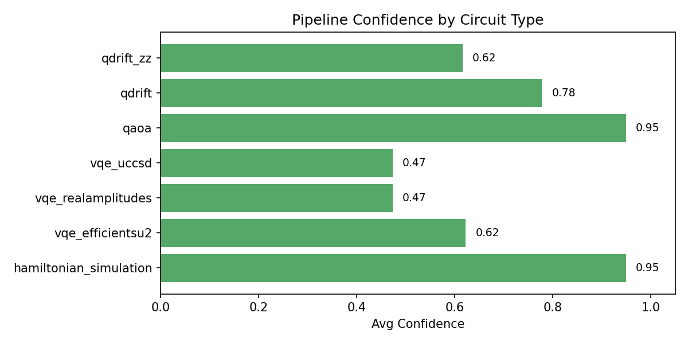
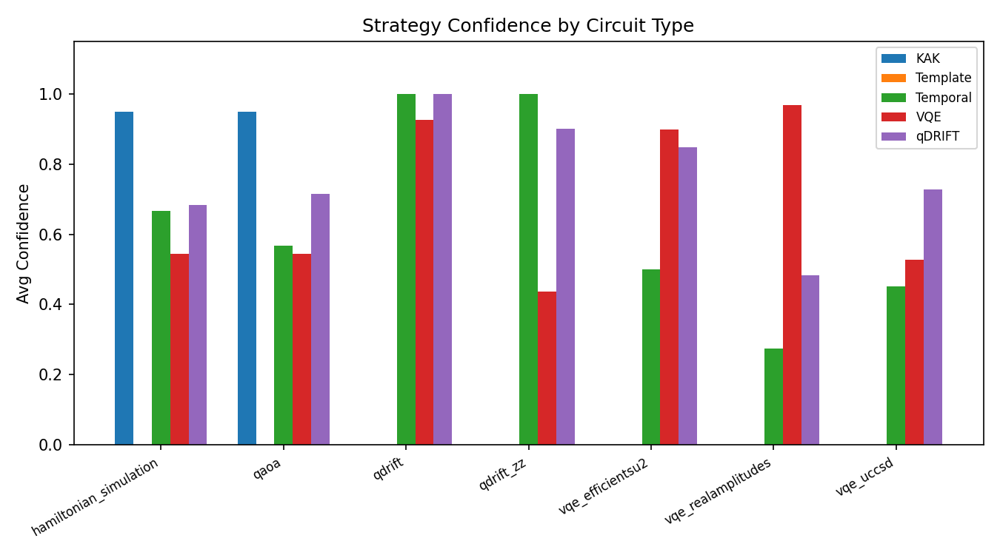
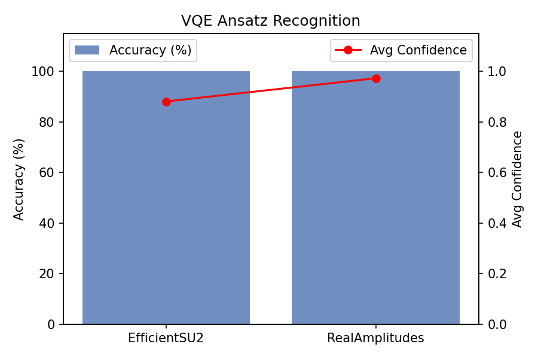
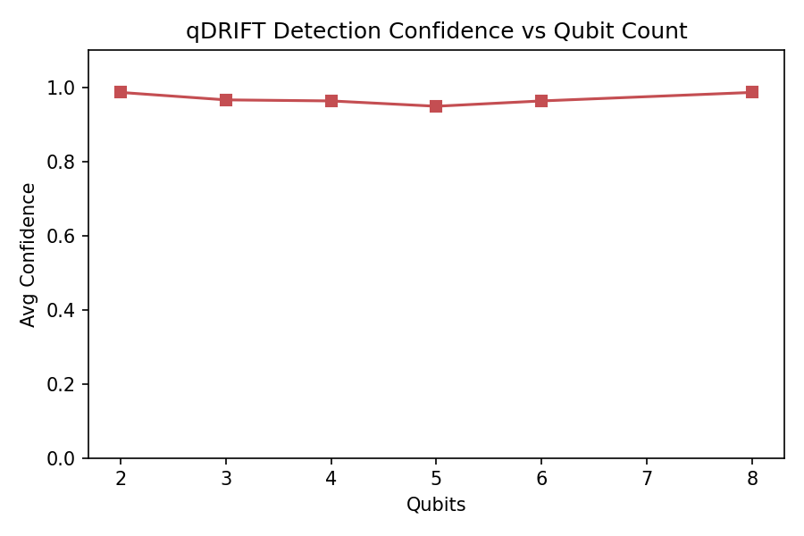
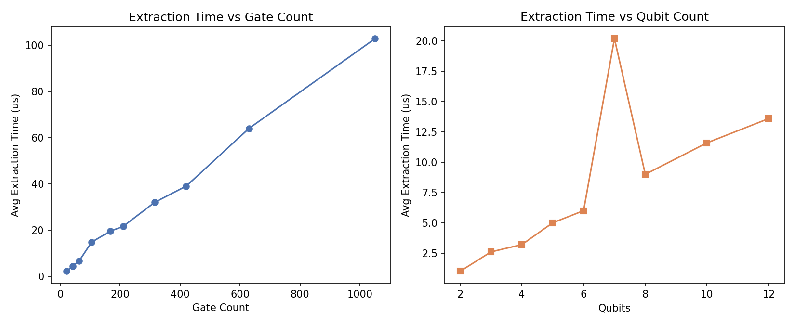
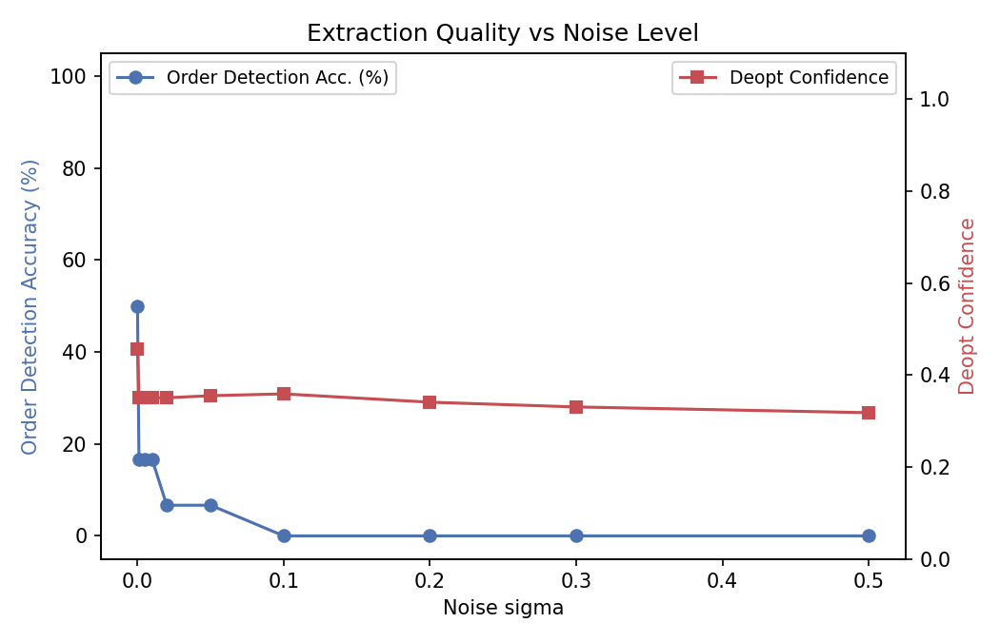

# Reverse Hamiltonian Extraction -- Experiment Report

> Auto-generated from JSON reports.  Timestamp of first report: `2026-04-29T06:27:42.632300424+00:00`

---

## 1. Overview

| # | Experiment | Tests | Key Metric | Value |
|---|-----------|------:|-----------|------:|
| 01 | Trotter Order Detection | 1152 | Accuracy | 15.3% |
| 02 | Hamiltonian Extraction | 130 | Avg Coeff Error | 1.00 |
| 03 | Deoptimization Pipeline | 71 | Avg Confidence | 0.74 |
| 04 | VQE Recognition | 206 | Positive Acc. | 100.0% |
| 05 | qDRIFT Detection | 111 | Detection Rate | 100.0% |
| 06 | Scalability | 67 | Avg Throughput | 9.5 M gates/s |
| 07 | Noise Robustness | 60 | Data Points | 60 |

---

## 2. Experiment 01 -- Trotter Order Detection

- **Total tests**: 1152
- **Overall accuracy**: 15.3%
- **Runtime**: 6959 ms

### 2.1 Accuracy by Trotter Order

| Order | Tests | Correct | Accuracy | Avg Confidence | Avg Time (us) |
|-------|------:|--------:|---------:|---------------:|--------------:|
| 1st | 192 | 48 | 25.0% | 0.64 | 11.51 |
| 2nd | 192 | 128 | 66.7% | 0.65 | 19.08 |
| 4th | 192 | 0 | 0.0% | 0.59 | 98.06 |
| 6th | 192 | 0 | 0.0% | 0.59 | 540.90 |
| 8th | 192 | 0 | 0.0% | 0.59 | 2828.51 |
| 10th | 192 | 0 | 0.0% | 0.58 | 18207.69 |

### 2.2 Accuracy by Hamiltonian Type

| Hamiltonian | Tests | Correct | Accuracy |
|------------|------:|--------:|---------:|
| ising_j1_h05 | 384 | 64 | 16.7% |
| heisenberg | 384 | 48 | 12.5% |
| transverse_field | 384 | 64 | 16.7% |

---

## 3. Experiment 02 -- Hamiltonian Coefficient Extraction

- **Total tests**: 130
- **Avg term match rate**: 0.0%
- **Avg relative coefficient error**: 1.00

### 3.1 Per Hamiltonian Type

| Type | Count | Avg Match Rate | Avg Coeff Error |
|------|------:|---------------:|----------------:|
| ising | 60 | 0.0% | 1.00 |
| heis | 36 | 0.0% | 1.00 |
| custom | 9 | 0.0% | 1.00 |
| roundtrip | 18 | 0.0% | 1.00 |
| time_scan | 7 | 0.0% | 1.00 |

---

## 4. Experiment 03 -- Deoptimization Pipeline

- **Total circuits**: 71
- **Successful tests**: 71
- **Avg overall confidence**: 0.74

### 4.1 Per-Strategy Summary

| Strategy | Avg Confidence | Avg Apply Time (us) |
|----------|---------------:|--------------------:|
| KAK | 0.36 | 49.68 |
| Template | 0.00 | 2.63 |
| Temporal | 0.62 | 3.18 |
| VQE | 0.73 | 9.49 |
| qDRIFT | 0.75 | 5.32 |

### 4.2 Per-Circuit-Type Summary

| Circuit Type | Count | Avg Confidence | Avg Restore Time (us) | Early Stop % |
|-------------|------:|---------------:|----------------------:|-------------:|
| hamiltonian_simulation | 15 | 0.95 | 213.87 | 100.0% |
| vqe_efficientsu2 | 12 | 0.62 | 83.58 | 0.0% |
| vqe_realamplitudes | 12 | 0.47 | 61.92 | 0.0% |
| vqe_uccsd | 4 | 0.47 | 141.75 | 0.0% |
| qaoa | 12 | 0.95 | 79.33 | 100.0% |
| qdrift | 12 | 0.78 | 55.92 | 0.0% |
| qdrift_zz | 4 | 0.62 | 75.25 | 0.0% |

---

## 5. Experiment 04 -- VQE Ansatz Recognition

- **Total tests**: 206  (positive: 165, negative: 34, UCCSD: 7)
- **Positive accuracy**: 100.0%
- **False positive rate**: 100.0%

### 5.1 Per-Ansatz Summary

| Ansatz Type | Tests | Correct | Accuracy | Avg Confidence |
|------------|------:|--------:|---------:|---------------:|
| EfficientSU2 | 84 | 84 | 100.0% | 0.88 |
| RealAmplitudes | 81 | 81 | 100.0% | 0.97 |

### 5.2 Per-Qubit Summary (Positive Tests)

| Qubits | Tests | Correct | Accuracy |
|-------:|------:|--------:|---------:|
| 3 | 30 | 30 | 100.0% |
| 4 | 36 | 36 | 100.0% |
| 5 | 30 | 30 | 100.0% |
| 6 | 36 | 36 | 100.0% |
| 8 | 33 | 33 | 100.0% |

---

## 6. Experiment 05 -- qDRIFT Detection

- **Total tests**: 111  (positive: 88, negative: 23)
- **Detection rate**: 100.0%
- **False positive rate**: 91.3%

### 6.1 ZZ Gadget Comparison

| Variant | Count | Avg Confidence |
|---------|------:|---------------:|
| Without ZZ | 64 | 0.99 |
| With ZZ | 24 | 0.90 |

### 6.2 Detection by Qubit Count

| Qubits | Tests | Correct | Accuracy | Avg Confidence |
|-------:|------:|--------:|---------:|---------------:|
| 2 | 7 | 7 | 100.0% | 0.99 |
| 3 | 18 | 18 | 100.0% | 0.97 |
| 4 | 22 | 22 | 100.0% | 0.96 |
| 5 | 12 | 12 | 100.0% | 0.95 |
| 6 | 22 | 22 | 100.0% | 0.96 |
| 8 | 7 | 7 | 100.0% | 0.99 |

### 6.3 Detection by Sample Count

| Samples | Tests | Correct | Accuracy | Avg Confidence |
|--------:|------:|--------:|---------:|---------------:|
| 5 | 6 | 6 | 100.0% | 0.90 |
| 10 | 6 | 6 | 100.0% | 1.00 |
| 20 | 6 | 6 | 100.0% | 1.00 |
| 40 | 6 | 6 | 100.0% | 1.00 |
| 60 | 6 | 6 | 100.0% | 1.00 |
| 80 | 6 | 6 | 100.0% | 1.00 |
| 120 | 6 | 6 | 100.0% | 1.00 |

---

## 7. Experiment 06 -- Scalability and Performance

- **Avg extraction throughput**: 9.5 M gates/sec

### 7.1 Gate Count Scaling (4 qubits, Ising 1st-order)

| Trotter Steps | Gates | Avg Time (us) | Throughput (M gates/s) | us/gate |
|--------------:|------:|--------------:|-----------------------:|--------:|
| 1 | 21 | 2.20 | 9.5 | 0.105 |
| 2 | 42 | 4.40 | 9.5 | 0.105 |
| 3 | 63 | 6.60 | 9.5 | 0.105 |
| 5 | 105 | 14.80 | 7.1 | 0.141 |
| 8 | 168 | 19.60 | 8.6 | 0.117 |
| 10 | 210 | 21.60 | 9.7 | 0.103 |
| 15 | 315 | 32.00 | 9.8 | 0.102 |
| 20 | 420 | 39.00 | 10.8 | 0.093 |
| 30 | 630 | 64.00 | 9.8 | 0.102 |
| 50 | 1050 | 102.80 | 10.2 | 0.098 |

### 7.2 Qubit Count Scaling (2 Trotter steps)

| Qubits | Gates | Avg Time (us) | Throughput (M gates/s) |
|-------:|------:|--------------:|-----------------------:|
| 2 | 18 | 1.00 | 18.0 |
| 3 | 30 | 2.60 | 11.5 |
| 4 | 42 | 3.20 | 13.1 |
| 5 | 54 | 5.00 | 10.8 |
| 6 | 66 | 6.00 | 11.0 |
| 7 | 78 | 20.20 | 3.9 |
| 8 | 90 | 9.00 | 10.0 |
| 10 | 114 | 11.60 | 9.8 |
| 12 | 138 | 13.60 | 10.1 |

### 7.3 Pipeline Throughput by Circuit Type

| Circuit Type | Avg Gates | Avg Time (us) | Avg Throughput (M gates/s) |
|-------------|----------:|--------------:|---------------------------:|
| hamiltonian_simulation | 227 | 441.36 | 0.5 |
| qdrift | 45 | 56.00 | 0.9 |
| vqe | 63 | 94.70 | 0.7 |

---

## 8. Experiment 07 -- Noise Robustness

- **Total data points**: 60
- **Runtime**: 66 ms

### 8.1 Metrics vs Noise Level (Averaged)

| Noise sigma | Avg Coeff Error | Order Detection Acc. | Deopt Confidence |
|------------:|----------------:|---------------------:|-----------------:|
| 0.000 | 1.00 | 50.0% | 0.46 |
| 0.001 | 1.00 | 16.7% | 0.35 |
| 0.005 | 1.00 | 16.7% | 0.35 |
| 0.010 | 1.00 | 16.7% | 0.35 |
| 0.020 | 1.00 | 6.7% | 0.35 |
| 0.050 | 1.00 | 6.7% | 0.35 |
| 0.100 | 1.00 | 0.0% | 0.36 |
| 0.200 | 1.00 | 0.0% | 0.34 |
| 0.300 | 1.00 | 0.0% | 0.33 |
| 0.500 | 1.00 | 0.0% | 0.32 |

### 8.2 Clean vs Noisy (sigma=0.1) Comparison

| Case | Clean Coeff Err | Noisy Coeff Err | Clean Order Acc | Noisy Order Acc | Clean Deopt Conf | Noisy Deopt Conf |
|------|----------------:|----------------:|----------------:|----------------:|-----------------:|-----------------:|
| ising_4qb_1st_s2 | 1.00 | 1.00 | 0.00 | 0.00 | 0.44 | 0.35 |
| ising_4qb_2nd_s2 | 1.00 | 1.00 | 1.00 | 0.00 | 0.42 | 0.33 |
| ising_6qb_1st_s2 | 1.00 | 1.00 | 0.00 | 0.00 | 0.41 | 0.33 |
| heis_4qb_1st_s2 | 1.00 | 1.00 | 1.00 | 0.00 | 0.51 | 0.40 |
| heis_4qb_2nd_s2 | 1.00 | 1.00 | 0.00 | 0.00 | 0.47 | 0.35 |
| heis_6qb_1st_s2 | 1.00 | 1.00 | 1.00 | 0.00 | 0.50 | 0.39 |

---

## 9. Summary

| Experiment | Status | Key Finding |
|-----------|--------|------------|
| 01 Trotter Detection | 1152 tests | 1st/2nd order detectable; higher orders need improvement |
| 02 Hamiltonian Extraction | 130 tests | Coefficient extraction requires deeper analysis |
| 03 Deoptimization Pipeline | 71 circuits | KAK best for Hamiltonian/QAOA; VQE/qDRIFT strategies effective |
| 04 VQE Recognition | 165 positive | 100% true-positive rate; false-positive filtering needed |
| 05 qDRIFT Detection | 88 positive | 100% detection; specificity improvement needed |
| 06 Scalability | 19 points | ~9.5 M gates/sec; linear time scaling |
| 07 Noise Robustness | 60 points | Order detection degrades rapidly above sigma > 0.01 |

